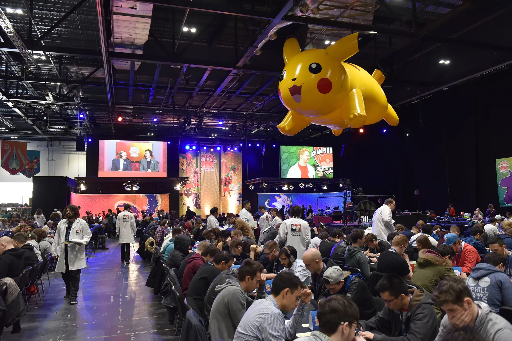

# A network-oriented analysis over Pokémon TCG competitive scene

Este é um projeto desenvolvido para a disciplina de Redes Sociais do curso de Engenharia de Computação do Insper (semestre 2023/2).

**Autores**:

- [Arthur Barreto](https://github.com/Arthur-Barreto)
- [Enricco Gemha](https://github.com/G3mha)
- [Felipe Catapano](https://github.com/MekhyW)

## Glossário

- *Deck* = baralho;
- *Set* = coleção;
- Pokémon® TCG = Pokémon Trading Card Game®;
- *Vanilla* = padrão/básica;
- Tipos de carta = Pokémon, Treinador, Energia;
- Formato Padrão = formato de jogo oficial, que permite o uso de cartas lançadas a partir de determinada coleção. Ele é atualizado anualmente, e as cartas mais antigas são removidas do formato;
- Versões de cartas = cartas que possuem mudanças puramente estéticas, mas que possuem as mesmas propriedades. Por exemplo, algumas cartas que possuem uma versão *vanilla* e uma versão *full art*;
- Código da carta = identificador único do modelo da carta em determinada coleção. Pode ser encontrada no canto inferior esquerdo da carta.

## Descrição do Projeto

O projeto tem como objetivo analisar a influência das cartas usadas por jogadores competitivos de Pokémon TCG, verificando o impacto deles no ranking obtido pelos jogadores. Caso queira saber mais sobre o jogo, veja este artigo do [Pokémon Blast News](https://www.poke-blast-news.net/2010/09/o-que-e-tcg.html). Para isso, foi gerada uma rede que relaciona cartas, a partir de uma base de dados com informações delas.

Para criar a base de dados foi realizado o *webscraping* dos dados contidos em [LimitlessTCG](https://limitlesstcg.com/), um site que disponibiliza muitas informações sobre o cenário competitivo do jogo.

Ressaltamos que os dados extraídos são referentes a todos os campeonatos oficiais disputados entre 2011 e 2023.

Ignoraremos cartas de energia, já que elas estão presentes em todos os decks, e portanto não necessariamente impactam o desempenho de um deck, mas sim complementam a estratégia dele. Nenhum deck é pensado com foco na carta de energia, mas sim pela carta de Pokémon ou Treinador, que demandará uma determinada energia para ser usada.

As cartas que possuem mais de uma versão, com mudanças puramente estéticas, foram considerados como iguais. Para efeito de identificador único das cartas, levamos em conta, então, o código de sua versão *vanilla* mais antiga, ou seja, a versão mais comumente encontrada nos pacotes disponíveis para venda, na coleção mais antiga lançada desta carta. Vamos entender melhor como isso ocorre:

*"A carta abaixo possui três versões, cada uma com propriedades idênticas, porém com alterações no desenho, auto-relevo e código da carta (MEW003, MEW182, MEW198). Portanto, quando MEW182 e MEW198 aparecerem em um deck, usaremos o id MEW003 para representá-las."*

*"O segundo caso em que isso ocorre é para cartas que foram impressas em mais de uma coleção. No caso abaixo, a carta SVI196 foi lançada em 2023, enquanto DEX102 foi lançada em 2012. Ambas são válidas para uso no formato Padrão do jogo. Portanto, quando a carta SVI196 aparecer, usaremos o id DEX102 para identificá-la."*

### Conceito de aresta e vértices

Para o conceito de **vértices** foi adotado que:

- Cada carta é um vértice, sem distinção entre cartas iguais de raridade diferente, ou cartas que tiveram reimpressão.

Para o conceito de **aresta** foi adotado:

- Duas cartas possuem um relacionamento (aresta) se estão presentes no mesmo deck.
- O peso da aresta entre duas cartas é o número de decks em que ambas estão listadas.

### Variáveis

Como variáveis de análise temos:

- `id_card` : identificador único de cada carta presente em cada deck. Ele segue o formato `<set><número>`;
- `id_tournament` : identificador único do torneio no qual o deck participou. Ele segue o formato `<ano>_<mes>_<dia>_<nome do torneio>`;
- `id_player` : identificador único do jogador que usou determinado deck. Ele segue o formato utilizado pelo site do LimitlessTCG `<int maior ou igual a 0>`;
- `tournament_rank` : posição do deck no torneio que disputou. Ele segue o formato `<int maior que 0>`;
- `tournament_type` : tipo de torneio disputado (ex.: Mundial, Internacional, Nacional, Regional, torneios menores). Ele segue o formato `<string>`, e possui uma característica ordinal, ou seja, é possível ordenar os tipos de torneio de acordo com sua importância;

### Hipótese

> "Uma maior sinergia entre cartas leva a uma maior chance de ganhar um torneio."

Sinergia é o quanto duas cartas combinam, para serem usadas no mesmo deck. Representamos a sinergia pelo peso das arestas.
